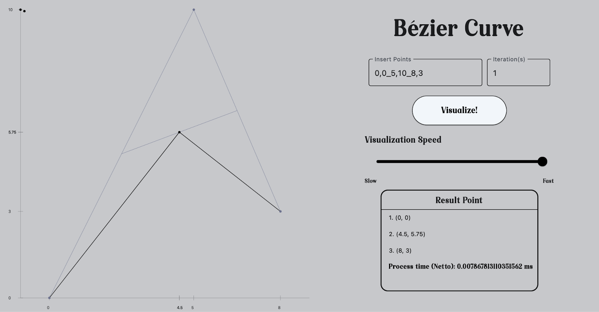
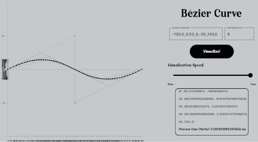
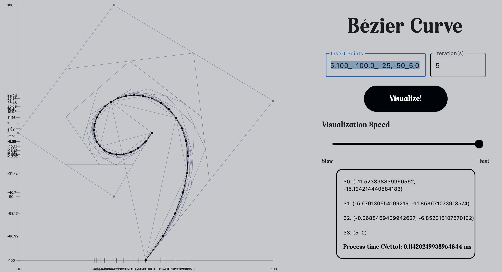

# Membangun Kurva Bézier dengan Algoritma Titik Tengah berbasis Divide and Conquer
> Aurelius Justin Philo Fanjaya - 13522020
>
> Steven Tjhia - 13522103

## Table of Contents
* [General Info](#general-information)
* [Technologies Used](#technologies-used)
* [Features](#features)
* [Screenshots](#screenshots)
* [Setup](#setup)
* [Usage](#usage)
* [Project Status](#project-status)
* [Room for Improvement](#room-for-improvement)

## General Information
- This project aims to solve Bézier Curve with **Divide and Conquer** Alogrithm.

## Technologies Used
- Python - version 3.11.0

## Features
- Accepting input by number of point(s), coordinate of the point, and number of iteration on Bézier Curve.
- Input(s) validation
- Visualization of Bézier Curve

## GUI Screenshots

## Setup

### Windows

1. From Tucil2_13522020_13522103 directory, navigate to "src" directory

    `cd src`

2. Install flet

    `pip install flet`

    If there's access problem, try this instead:

    `pip install flet --user`

    If haven't solved yet, you might want to find the solution on the internet

3. Run app.py program

    `python app.py`
    
### Linux / WSL

1. From Tucil2_13522020_13522103 directory, navigate to "src" directory

    `cd src`

2. Install flet

    `pip install flet`

3. Install GStreamer

    `sudo apt install libgtk-3-0`

    `sudo apt-get install gstreamer1.0-plugins-bad gstreamer1.0-plugins-ugly gstreamer1.0-libav`

    `sudo apt-get update`

    `sudo apt-get install libgstreamer1.0-dev libgstreamer-plugins-base1.0-dev libgstreamer-plugins-bad1.0-dev gstreamer1.0-plugins-base gstreamer1.0-plugins-good gstreamer1.0-plugins-bad gstreamer1.0-plugins-ugly gstreamer1.0-libav gstreamer1.0-doc gstreamer1.0-tools gstreamer1.0-x gstreamer1.0-alsa gstreamer1.0-gl gstreamer1.0-gtk3 gstreamer1.0-qt5 gstreamer1.0-pulseaudio`

4. Run app.py program

    `python3 app.py`

## Usage

1. Insert points and number of iteration in each textfield

2. Press "Visualize!" button

3. Set the visualization speed by adjusting the slider as you wish

4. Enjoy the process, while looking at the "Result Point" listview to see the point made on the result curve 

5. When the process is finished, you can see the execution time of the __Divide and Conquer Algorithm__ on the bottom of "Result Point" listview

## Project Status
Project is: _complete_.

## Room for Improvement
- Interrupt feature while processing current curve
